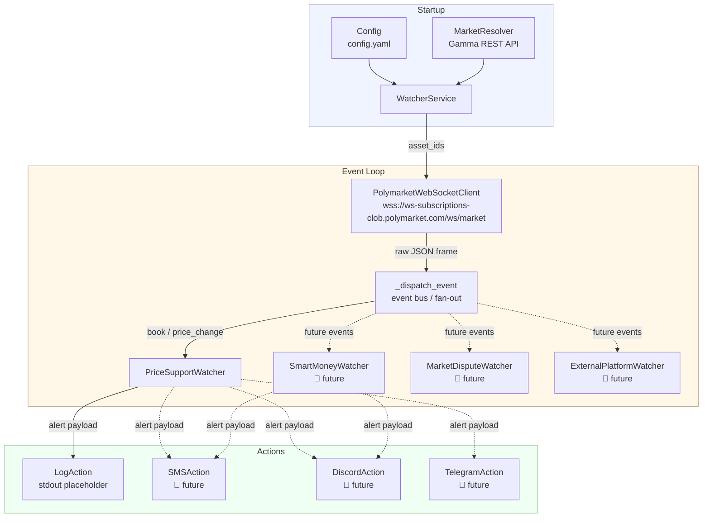

# Architecture — Polymarket Watcher

## High-Level Design

The service is intentionally built around a **Watcher / Action** abstraction
so that new observable events and new notification channels can be added
without touching existing code.



## Module Map

```
polymarket_watcher/
├── __init__.py
├── config.py              ← dataclass-based YAML config loader
├── market_resolver.py     ← slug → (yes_token_id, no_token_id) via Gamma API
├── order_book.py          ← local OrderBook state, bid_support_within_pct()
├── websocket_client.py    ← auto-reconnecting WebSocket client (websockets lib)
├── service.py             ← orchestrator: wires everything together
├── main.py                ← entry point with signal handling
├── watchers/
│   ├── base_watcher.py          ← abstract BaseWatcher
│   └── price_support_watcher.py ← detects bid-support drop alerts
└── actions/
    ├── base_action.py    ← abstract BaseAction
    └── log_action.py     ← placeholder: logs alert payload to stdout
```

## Data Flow

1. **Startup** — `WatcherService` loads `Config`, resolves the market slug to
   two CLOB token IDs (YES + NO) via the Gamma REST API, then instantiates
   all configured watchers.
2. **Connection** — `PolymarketWebSocketClient` opens a persistent WebSocket
   to `wss://ws-subscriptions-clob.polymarket.com/ws/market` and sends a
   subscription frame containing both token IDs.
3. **Inbound events** — The API sends two kinds of events:
   * `book` — full order-book snapshot (sent on subscription and after major
     state changes).
   * `price_change` — incremental update to one or more price levels.
4. **Dispatch** — `WatcherService._dispatch_event` fans each event out to
   every registered watcher.  Watchers that declare `supported_event_types`
   are skipped for irrelevant events (performance optimisation).
5. **Watchers** — Each watcher maintains its own internal state (e.g. a local
   `OrderBook` copy) and fires **Actions** when its condition is met.
6. **Actions** — Each action receives a structured `event_data` dict and
   performs a side-effect (log, SMS, Discord message, etc.).

---

## How to Add a New Watcher

1. **Create a module** in `polymarket_watcher/watchers/`, e.g.
   `smart_money_watcher.py`.

2. **Subclass `BaseWatcher`**:

   ```python
   from ..watchers.base_watcher import BaseWatcher
   from typing import Any, FrozenSet

   class SmartMoneyWatcher(BaseWatcher):
       supported_event_types: FrozenSet[str] = frozenset({"price_change"})

       @property
       def name(self) -> str:
           return "SmartMoneyWatcher"

       def on_event(self, event: dict[str, Any]) -> None:
           # Inspect the event and fire actions if relevant.
           ...
   ```

3. **Add configuration** (optional) — add a new dataclass to `config.py` and
   a matching YAML key in `config.yaml`.

4. **Register the watcher** — inside `WatcherService._build_watchers()` in
   `service.py`, instantiate and append your watcher:

   ```python
   if cfg.watcher.smart_money.enabled:
       watchers.append(SmartMoneyWatcher(..., actions=actions))
   ```

That's it — no other file needs to change.

---

## How to Add a New Action

1. **Create a module** in `polymarket_watcher/actions/`, e.g.
   `discord_action.py`.

2. **Subclass `BaseAction`**:

   ```python
   import httpx
   from .base_action import BaseAction
   from typing import Any

   class DiscordAction(BaseAction):
       def __init__(self, webhook_url: str) -> None:
           self._webhook_url = webhook_url

       @property
       def name(self) -> str:
           return "DiscordAction"

       def execute(self, event_data: dict[str, Any]) -> None:
           content = f"🚨 **{event_data['watcher']}** alert\n```json\n{event_data}\n```"
           httpx.post(self._webhook_url, json={"content": content})
   ```

3. **Wire the action** — in `WatcherService._build_watchers()`, add it to the
   `actions` list:

   ```python
   actions = [LogAction(), DiscordAction(webhook_url=cfg.actions.discord.webhook_url)]
   ```

---

## Ideas for Future Watchers

| Watcher | Trigger | Data source |
|---|---|---|
| `SmartMoneyWatcher` | Large single orders above threshold | `price_change` / CLOB WS |
| `MarketDisputeWatcher` | Dispute / resolution event | Polymarket REST API |
| `LiquidityDepthWatcher` | Spread or depth crosses threshold | `book` event |
| `ExternalPlatformWatcher` | Correlated price movement on Kalshi / Metaculus | External REST polling |
| `VolumeSpike Watcher` | 24-h volume spike vs rolling average | Gamma REST API |
