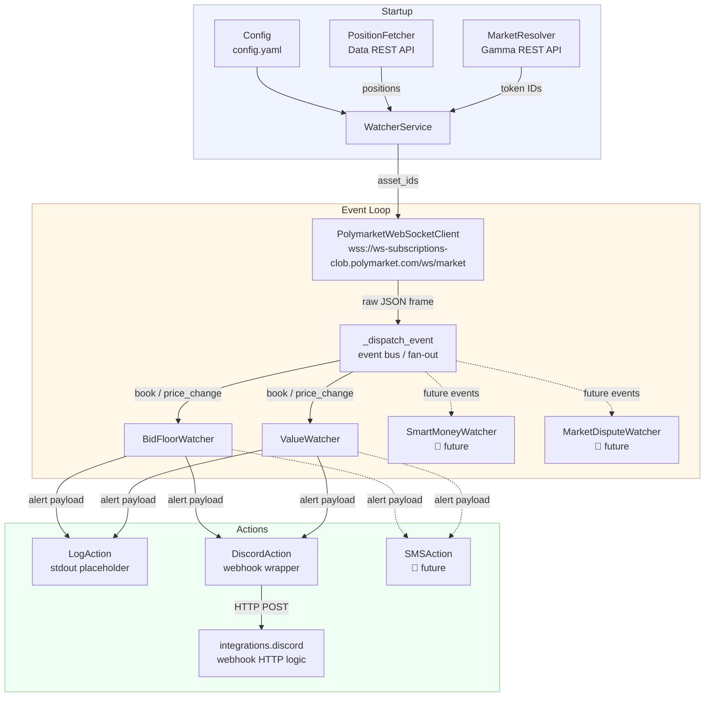

# Architecture

The service is intentionally built around a **Watcher / Action** abstraction
so that new observable events and new notification channels can be added
without touching existing code.

## High-Level Design



## Module Map

```
polymarket_watcher/
├── __init__.py
├── config.py              ← dataclass-based YAML config loader
├── market_resolver.py     ← slug → (yes_token_id, no_token_id) via Gamma API
├── order_book.py          ← local OrderBook state, bid_volume_in_range()
├── position_fetcher.py    ← fetch open positions from the Polymarket Data API
├── websocket_client.py    ← auto-reconnecting WebSocket client (websockets lib)
├── service.py             ← orchestrator: wires everything together
├── main.py                ← entry point with signal handling
├── admin/                 ← local admin CLI (SSH-based, run on your machine)
│   ├── admin_config.py    ← per-user config (~/.config/polymarket-watcher/admin.yaml)
│   ├── cli.py             ← Click-based CLI (init/status/logs/restart/config)
│   ├── editor.py          ← cross-platform editor selection ($EDITOR / VS Code / nano)
│   ├── ssh.py             ← ssh/scp subprocess helpers
│   └── tui.py             ← streaming log viewer (journalctl -f over SSH)
├── integrations/          ← vendor-specific HTTP / protocol logic
│   └── discord.py         ← Discord webhook: payload building + HTTP transport
├── watchers/
│   ├── base_watcher.py          ← abstract BaseWatcher
│   ├── bid_floor_watcher.py     ← alerts when bid-floor volume is insufficient
│   └── value_watcher.py         ← fires escalating alerts on position value loss
└── actions/
    ├── base_action.py       ← abstract BaseAction (public plugin interface)
    ├── log_action.py        ← placeholder: logs alert payload to stdout
    └── discord_action.py    ← slim wrapper: reads DISCORD_WEBHOOK_URL from env,
                               delegates to integrations.discord
```

## Data Flow

1. **Startup** — `WatcherService` loads `Config` and chooses one of two paths:
   - **Auto-discovery (primary):** if `account.proxy_wallet` is set,
     `position_fetcher.fetch_positions()` queries the Polymarket Data API and
     returns all open positions.  A `BidFloorWatcher` and a `ValueWatcher` are
     instantiated for each position.
   - **Manual fallback:** if no proxy wallet is configured, the `[market]`
     section is used to watch a single market.  `MarketResolver` resolves the
     slug to two CLOB token IDs (YES + NO), and watchers are created for the
     configured direction.
2. **Connection** — `PolymarketWebSocketClient` opens a persistent WebSocket
   to `wss://ws-subscriptions-clob.polymarket.com/ws/market` and sends a
   subscription frame containing all relevant token IDs.
3. **Inbound events** — The API sends two kinds of events:
   - `book` — full order-book snapshot (sent on subscription and after major
     state changes).
   - `price_change` — incremental update to one or more price levels.
4. **Dispatch** — `WatcherService._dispatch_event` fans each event out to
   every registered watcher.  Watchers that declare `supported_event_types`
   are skipped for irrelevant events (performance optimisation).
5. **Watchers** — Each watcher maintains its own internal state (e.g. a local
   `OrderBook` copy) and fires **Actions** when its condition is met.
6. **Actions** — Each action receives a structured `event_data` dict and
   performs a side-effect (log, SMS, Discord message, etc.).

## Ideas for Future Watchers

| Watcher | Trigger | Data source |
|---|---|---|
| `SmartMoneyWatcher` | Large single orders above threshold | `price_change` / CLOB WS |
| `MarketDisputeWatcher` | Dispute / resolution event | Polymarket REST API |
| `LiquidityDepthWatcher` | Spread or depth crosses threshold | `book` event |
| `ExternalPlatformWatcher` | Correlated price movement on Kalshi / Metaculus | External REST polling |
| `VolumeSpikeWatcher` | 24-h volume spike vs rolling average | Gamma REST API |
